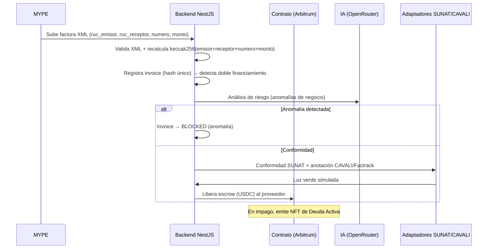

# Arquitectura técnica — InvoiceShield

## 1. Visión general

InvoiceShield es un **protocolo descentralizado** para factoring de MYPES en el Perú que combina:

- **Registro inmutable on-chain** de facturas (huella `keccak256`) → anti doble financiación.
- **Escrow condicionado** de USDC liberado solo tras validaciones oráculo (SUNAT/CAVALI simulados).
- **Subastas BlindBid** (commit–reveal) para adjudicar deuda activa de forma transparente.
- **Auditoría de riesgo por IA** (OpenRouter/Nemotron) y scoring compuesto precio + calidad.

Capa | Tecnología | Rol
---|---|---
**Frontend** | Next.js 16, Tailwind v4, wagmi/viem, RainbowKit | Visualización y firma de transacciones del usuario
**Backend** | NestJS 11, Prisma 6 | Autoridad de negocio: RBAC, validaciones, hashes, orquestación on-chain
**Datos** | Neon PostgreSQL | Espejo relacional + logs WORM
**Contrato** | BlindBidVault (Arbitrum Sepolia) | Subastas commit–reveal, escrow de stakes

## 2. Flujo principal de financiamiento (factoring)



## 3. Subastas BlindBid (commit–reveal)

El contrato `BlindBidVault` implementa subastas de **oferta sellada** para vender deuda activa.

### Estados de una subasta

```
ACTIVE (commit window → reveal window)
   │  commitEnd
   ▼
ACTIVE (reveal window)
   │  revealEnd → settleAuction()
   ▼
SETTLED (ganador + precio adjudicado)   CANCELLED
```

### Mecánica

1. **Organizador** crea la subasta: `createAuction(treasury, stakeAmount, minPrice, maxPrice, commitEnd, revealEnd)`. El backend firma y **espeja** el estado on-chain en la tabla `auction`.
2. **Postores** comprometen `commitBid(auctionId, commitment)` donde:
   ```
   commitment = keccak256(abi.encodePacked(uint256 price, string secret))
   price = parseUnits(priceUsd, 6)   # USDC, 6 decimales
   ```
   La fórmula vive duplicada a propósito en backend (`bidding.service.ts`) y frontend (`useBlindBidVault`) — es el **vínculo off-chain ↔ on-chain**.
3. **Reveal nativo**: `revealBid(auctionId, bidder, price, secret)` — el contrato verifica que `keccak256(encodePacked(price, secret)) == commitment.hash` antes de contabilizar.
4. **Reveal delegado (agente)**: el postor llama `POST /api/auctions/:id/delegate-reveal` con `(price, secret)`. El backend valida el commitment on-chain, **cifra el secret con AES-256-GCM** (`AGENT_ENCRYPTION_KEY`) y lo guarda en `delegation` para que el agente lo revele automáticamente al final del ventana.
5. **Scoring**: `priceWeight` + `qualityWeight` (porcentajes del contrato) combinan precio con `auditScores` (IA, rango 0–100) cargados por auditores vía `POST /api/auctions/:id/audit-score`.
6. **Settlement**: `settleAuction` adjudica al mejor score, devuelve/slash stakes, y el ganador recibe el NFT de la deuda.

### Invariantes de seguridad

- El **secret nunca viaja sin cifrar** fuera del TLS: se cifra AES-GCM en reposo y el frontend nunca lo persiste.
- El backend **recalcula el commitment** al delegar y rechaza `(price, secret)` que no matcheen (`INVALID_REVEAL_SECRET`).
- La subasta solo es liquidable después de `revealEnd` (regla on-chain).
- `commitEnd < revealEnd` validado tanto en backend (DTO) como en frontend.

## 4. Modelo de datos (Prisma)

- `users` · `sessions` (refresh rotatorio hash-SHA256) · `login_attempts`
- `factors` (entidades financieras) · `invoices` (huella única) · `validations` · `anomalies` · `fraud_alerts`
- `audit_logs` (**WORM**: triggers + `REVOKE` de UPDATE/DELETE)
- `auction` (espejo del contrato, único por `contractAddress+auctionId`) · `delegation` (secrets cifrados) · `audit_verdict` (scoring IA)

## 5. Seguridad

| Medida | Implementación |
|---|---|
| Sesión | Cookies `httpOnly`: `is_session` 15m + `is_refresh` 7d rotatorio single-use; lockout 5 intentos/15min |
| RBAC | 7 permisos, guards con super-gate para admins |
| Rate limit | login 20/15min, refresh 60/15min, global 300/min |
| Auditoría | `audit_logs` WORM vía triggers + `set_config('app.actor_user_id')` |
| Hash del activo | Calculado **solo en backend** (`shared/invoice-hash.ts`) |
| Oráculos | `AdapterService` (interfaz) con implementaciones simuladas SUNAT/CAVALI, reemplazables por oráculos reales |
| Secreto BlindBid | AES-256-GCM en reposo (`shared/crypto.service`) |
| Transporte | Helmet CSP, CORS restringido a `ALLOWED_ORIGINS`, ValidationPipe estricto |

## 6. Calidad (gate por fase)

- `lint` (ESLint estricto) · `typecheck` (`tsc --noEmit`) · `test` · `build` — exigidos en CI (`.github/workflows/ci.yml`).
- Backend: 39 unit + 4 e2e · Frontend: 21 unit (vitest).

## 7. Despliegue (fase 6)

- **Frontend → Vercel** (proyecto Next.js, root `frontend/`), proxy same-origin en `vercel.json` hacia el backend para cookies first-party.
- **Backend → Render** (Web Service, root `backend/`), `npx prisma migrate deploy && node dist/main.js`.
- **DB → Neon** (conexión pooled + `DATABASE_URL_UNPOOLED` para migraciones).

Detalle completo de despliegue en `CHANGELOG.md` → `[fase.6]`.
